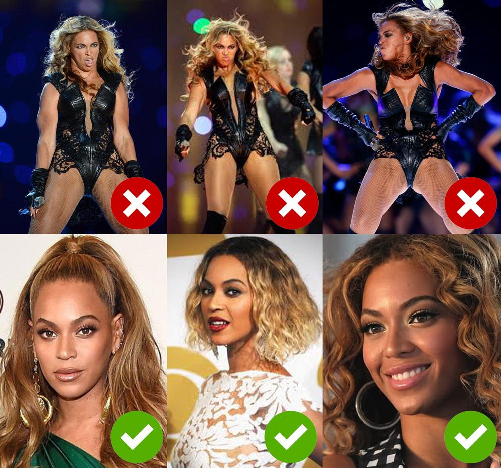

# Beyoncé EU Upload Filter

2013: Beyoncé's publicist asked to remove unflattering images from an [internet article](https://www.buzzfeed.com/buzzfeedceleb/the-unflattering-photos-beyonces-publicist-doesnt-want-you-t). Unfortunately, once an image is on the internet, it is there forever!
2018: The EU approves the controversial [EU copyright directive](http://www.europarl.europa.eu/news/en/press-room/20180906IPR12103/parliament-adopts-its-position-on-digital-copyright-rules) and the "upload filter" to fight against copyright violations, terrorism and ... unflattering  photos of Beyoncé.



## Setup

Run the server with:
```
bundle install
rails s
```

## Testing

Send a POST-multipart-request with an `image` parameter to the server for image validation:
```
curl -X POST \
  http://localhost:3000 \
  -H 'cache-control: no-cache' \
  -H 'content-type: multipart/form-data; boundary=----WebKitFormBoundary7MA4YWxkTrZu0gW' \
  -F 'image=@/path/to/file'
```

Or run the tests:
```
rails test
```